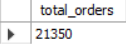
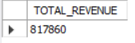
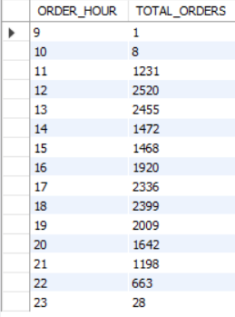
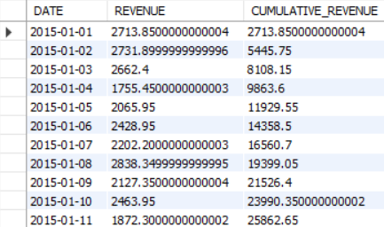

# Pizza Sales Analysis Using SQL

## Project Overview

This project focuses on analyzing a relational pizza sales database using SQL to extract meaningful business insights.  
The objective was to evaluate revenue performance, customer ordering patterns, product popularity, and category-wise sales distribution using structured queries.
The analysis was performed using MySQL Workbench on transactional sales data.

## Dataset Description

The database consists of four related tables:

- Orders  
- Order_Details  
- Pizzas  
- Pizza_Types  

### Table Relationships

Orders → Order_Details → Pizzas → Pizza_Types  

The dataset contains order timestamps, pizza categories, pricing information, and quantity sold.

## Tools & Technologies Used

- MySQL Workbench  
- SQL  
- Joins (INNER JOIN)  
- Aggregations (SUM, COUNT, AVG)  
- Subqueries  
- Window Functions (SUM() OVER)  
- Ranking Functions (RANK() with PARTITION BY)

## Business Problems Solved

### 🔹 Basic Analysis
- Total number of orders placed
- Total revenue generated
- Highest priced pizza
- Top 5 most ordered pizza types

### 🔹 Intermediate Analysis
- Category-wise quantity sold
- Hourly distribution of orders
- Average pizzas ordered per day
- Top 3 pizzas by revenue

### 🔹 Advanced Analysis
- Percentage contribution of each pizza to total revenue
- Cumulative revenue analysis over time
- Top 3 revenue-generating pizzas within each category

## Sample Query Results

### Total Orders Placed

### Total Revenue Generated

### Hourly Distribution of Orders

### Cumulative Revenue Over Time

## Key Sales & Performance Metrics

- Total Orders Placed: 21,350
- Total Revenue Generated: 817,860
- Average Daily Demand: 138 pizzas per day
- Highest Priced Item: The Greek Pizza (Classic Category) priced at 35.95

## Product & Category Performance

### 🔹 Top 5 Pizzas by Quantity Sold

1. The Classic Deluxe Pizza – 2,453
2. The Barbecue Chicken Pizza – 2,432
3. The Hawaiian Pizza – 2,422
4. The Pepperoni Pizza – 2,418
5. The Thai Chicken Pizza – 2,371

### 🔹 Category-wise Quantity Sold

- Classic: 14,888
- Supreme: 11,987
- Veggie: 11,649
- Chicken: 11,050

## Operational Insights

- Peak Lunch Hour: 12:00 PM (2,520 orders)
- Peak Dinner Hour: 6:00 PM (2,399 orders)
- Order volume drops significantly after 10:00 PM

This indicates strong mid-day and evening demand patterns.

## 💰 Revenue Insights

### 🔹 Top 3 Pizzas by Revenue

1. Thai Chicken Pizza – 43,434.25
2. Barbecue Chicken Pizza – 42,768
3. California Chicken Pizza – 41,409.5

### 🔹 Revenue Contribution (Top Performers)

- Thai Chicken Pizza: ~5.31%
- Barbecue Chicken Pizza: ~5.23%
- California Chicken Pizza: ~5.06%
- Classic Deluxe Pizza: ~4.67%
- Spicy Italian Pizza: ~4.26%

## 📈 Advanced Analysis

- Cumulative revenue trend was analyzed using window functions.
- Category-wise top 3 revenue-generating pizzas were identified using RANK() with PARTITION BY.
- 
## 💡 Business Recommendations

- Allocate additional staff during peak lunch and dinner hours.
- Focus promotional campaigns on high-performing pizzas.
- Optimize inventory planning based on category demand trends.
- Develop marketing strategies to boost underperforming categories.

## 📁 Project Files

- analysis_queries.sql → Contains all SQL queries used for analysis.
- screenshots/ → Contains selected result outputs
